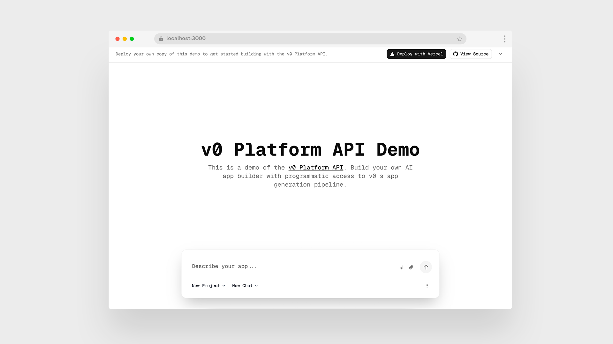

# Simple v0

The simplest way to use v0. Just prompt and see your app generated instantly - no chat management, no complexity. Build AI-powered apps with real-time generation and seamless deployment to Vercel.



## Deploy Your Own

You can deploy your own version of Simple v0 to Vercel with one click:

[](https://vercel.com/new/clone?repository-url=https%3A%2F%2Fgithub.com%2Fvercel%2Fv0-sdk%2Ftree%2Fmain%2Fexamples%2Fsimple-v0&env=V0_API_KEY&envDescription=Get+your+v0+API+key&envLink=https%3A%2F%2Fv0.app%2Fchat%2Fsettings%2Fkeys&project-name=simple-v0&repository-name=simple-v0&demo-title=Simple+v0&demo-description=The+simplest+way+to+use+v0+-+just+prompt+and+see+your+app&demo-url=https%3A%2F%2Fsimple-demo.v0-sdk.dev)

## Setup

1. **Install dependencies:**

   ```bash
   pnpm install
   ```

2. **Configure environment:**
   Create a `.env.local` file in the root directory:

   ```env
   V0_API_KEY=your_api_key_here

   # Optional: For rate limiting (if not provided, rate limiting is disabled)
   KV_REST_API_URL=your_kv_rest_api_url
   KV_REST_API_TOKEN=your_kv_rest_api_token
   ```

   - Get your v0 API key from [v0.dev/settings](https://v0.dev/settings)
   - Optionally get your Upstash Redis credentials from [upstash.com](https://upstash.com) for rate limiting

3. **Run development server:**

   ```bash
   pnpm dev
   ```

   Open [http://localhost:3000](http://localhost:3000) to view the application.

## Features

- **AI App Generation**: Create applications from natural language prompts using v0's AI
- **Project Management**: Organize your work into projects with multiple chat conversations
- **Live Preview**: Instantly preview generated applications in an embedded iframe
- **Chat Management**: Continue conversations, fork chats, rename, and delete as needed
- **One-Click Deployment**: Deploy generated apps directly to Vercel
- **File Attachments**: Upload images and files to enhance your prompts
- **Voice Input**: Use speech-to-text for hands-free prompt creation
- **Rate Limiting**: Built-in rate limiting (3 AI generations per 12 hours) to prevent abuse
- **Responsive Design**: Works seamlessly on desktop and mobile devices
- **Session Caching**: Improved performance with intelligent caching of projects and chats

## API Routes

- `GET /api/validate` - Validate API key
- `GET /api/projects` - List all projects
- `GET /api/projects/[id]` - Get project details with associated chats
- `POST /api/generate` - Generate or continue app conversation
- `GET /api/chats/[id]` - Retrieve chat details and history
- `DELETE /api/chats/[id]` - Delete a chat conversation
- `PATCH /api/chats/[id]` - Update chat (rename)
- `POST /api/chats/fork` - Create a new chat from an existing one
- `POST /api/deployments` - Deploy generated apps to Vercel

## Tech Stack

- **Framework:** Next.js 15 with App Router
- **Runtime:** React 19 with TypeScript
- **Styling:** Tailwind CSS 4
- **UI Components:** Radix UI primitives with custom styling
- **API Integration:** v0-sdk for Platform API communication
- **Rate Limiting:** Upstash Redis with sliding window algorithm
- **Fonts:** Geist Sans and Geist Mono via next/font
- **Build Tool:** Turbopack for fast development

## Rate Limiting

This application implements optional rate limiting to prevent abuse and ensure fair usage:

- **Limit:** 3 AI generations per 12 hours per IP address
- **What counts as 1 generation:** Each call to `v0.chats.create()` or `v0.chats.sendMessage()`
- **Scope:** Applies to all AI generation requests regardless of chat type
- **Implementation:** Uses Upstash Redis with a sliding window algorithm
- **Optional:** If Upstash credentials are not provided, rate limiting is disabled
- **Fallback:** If rate limiting service is unavailable, requests are allowed (fail-open strategy)

When the rate limit is exceeded, users receive a 429 status code with information about when they can try again.

## Project Structure

```
├── app/
│   ├── api/                    # API route handlers
│   │   ├── chats/[chatId]/     # Chat CRUD operations
│   │   ├── deployments/        # Vercel deployment handling
│   │   ├── generate/           # AI app generation
│   │   ├── projects/           # Project management
│   │   └── validate/           # API key validation
│   ├── components/             # App-specific components
│   ├── projects/[projectId]/   # Dynamic project pages
│   │   └── chats/[chatId]/     # Individual chat pages
│   ├── globals.css             # Global styles and Tailwind config
│   ├── layout.tsx              # Root layout with metadata
│   └── page.tsx                # Homepage with main interface
├── components/
│   └── ui/                     # Reusable UI components (buttons, dialogs, etc.)
├── lib/
│   ├── hooks/                  # Custom React hooks
│   └── utils.ts                # Utility functions
└── public/                     # Static assets
```

## Environment Variables

| Variable            | Required | Description                                                                             |
| ------------------- | -------- | --------------------------------------------------------------------------------------- |
| `V0_API_KEY`        | Yes      | Your v0 Platform API key from [v0.dev/settings](https://v0.dev/settings)                |
| `KV_REST_API_URL`   | No       | Upstash Redis REST URL for rate limiting (if not provided, rate limiting is disabled)   |
| `KV_REST_API_TOKEN` | No       | Upstash Redis REST token for rate limiting (if not provided, rate limiting is disabled) |

## Development Commands

```bash
# Install dependencies
pnpm install

# Start development server with Turbopack
pnpm dev

# Build for production
pnpm build

# Start production server
pnpm start

# Run linting
pnpm lint

# Format code
pnpm format

# Check formatting
pnpm format:check
```

## Usage

1. **Start Creating**: Enter a prompt describing the app you want to build
2. **Organize Work**: Create projects to group related conversations
3. **Iterate**: Continue conversations to refine and improve your apps
4. **Deploy**: One-click deployment to Vercel for sharing and testing
5. **Manage**: Rename, delete, or fork chats as your projects evolve

## Learn More

- [v0 Platform API Documentation](https://v0.dev/docs/api/platform)
- [Next.js Documentation](https://nextjs.org/docs)
- [Tailwind CSS](https://tailwindcss.com)
- [Radix UI](https://www.radix-ui.com)
